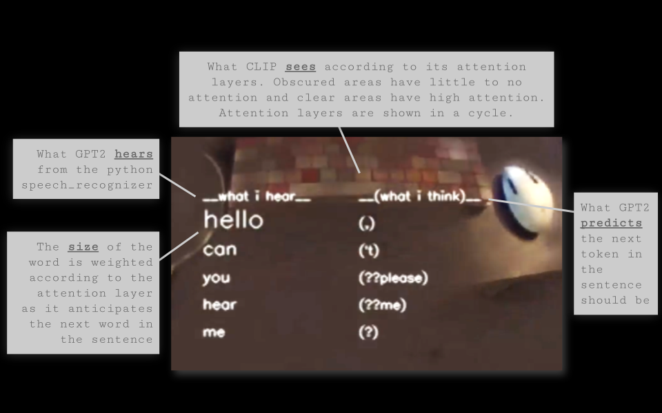

# Ghosts in a Shell (ALIFE23)

This is the code repository for the interactive art installation "Ghosts in a Shell", as seen at ALIFE23.

For this project, I used: 
- An HTC Vive headset (ONLY the headset, none of the controllers or silly floor-stick-camera things),
- Ubuntu 22.04 Jammin Jelly (you can NOT use WSL/WSL2 in Windows for this... sorry... I've tried), and
- A CUDA-capable graphics card NVIDIA RTX 3070.

When you run it as originally intended, with the headset and all, the user wearing the headset will see:
- The live video feed from the headset, but
- Some areas will be covered by patchy areas, and
- Two columns of text.

Here is an example of what the user will see, if all is running correctly:

You can read more about this art installation here: LINK TO BLOG POST.

I've also configured the code to work without the headset, so it can run with a video file. You can also toggle the visualized text on or off, depending on your needs/uses.

## How to install the prerequisites

For using a Vive headset, processing a video file, with or without text,, or modifying the live feed from your webcam, you'll need to:
- Install CUDA, 
- then create your venv in Python 3.10, 
- then install the required packages from REQUIREMENTS.txt.

I used this combination:
- CUDA 11.7 (on ubuntu 22.04, this worked, but I had to do it twice, install, uninstall, then reinstall: https://gist.github.com/primus852/b6bac167509e6f352efb8a462dcf1854)
- torch 1.13.1, torchaudio 0.13.1, torchvision 0.14.1: pip install torch==1.13.1+cu117 torchvision==0.14.1+cu117 torchaudio==0.13.1 --extra-index-url https://download.pytorch.org/whl/cu117

If using a Vive headset: Before you configure your graphics drivers to read the headset, first use a USB camera and pretend it is the camera and mic from the headset. That is just to ensure all your Python-side software is working correctly.

If only processing a video file (no camera at all), then you can get away without using a CUDA-capable graphics card, but the result will be slow. You'll have to wait a while for each frame to render.

## Running loop.py

I didn't configure a CLI, so you should change the variables in "__name__ == '__main__':" directly (line 290 in loop.py):
- device = "cuda"  # "cuda" for a cuda-capable graphics card, "cpu" otherwise
- camera_type = "headset"  # "headset for HTC Vive, else "webcam" for USB/built-in webcam, or "file" for file (if file, drop your file in the same directory as loop.py)
- process_text = True  # True or false

loop.py using multiprocessing. The three processes are:
- video_part: Processing the video (including any text to display),
- listen_part: Listening for any spoken words, and
- text_attender_part: Processing the text.

video_part will read in the video input (camera or file) frame by frame, then process each frame to some output to display. It also looks for any files that the text attender makes (text_attns) and displays the text based on the file contents.

The text_attender_part looks for a file that the listen_part makes (text). If it finds this file, then it creates text_attns.

If the text file doesn't exist, then the listen_part activates to listen for spoken words. It saves what it hears to the text file.

Once the text is displayed on the output frames for a certain number of frames (some amount of time), then the text_attns and text files are deleted.

## Run loop.py on a video file

Install REQUIREMENTS.txt

Change the following variables:

- device = "cuda"
(or device = "cpu" if you don't have a CUDA-capable GPU)
- camera_type = "file"
(Put the file in the same directory as loop.py)
- process_text = True  # True or False

Run loop.py

## Run loop.py with a USB or integrated webcam

Install REQUIREMENTS.txt

Change the following variables:

- device = "cuda"
- camera_type = "webcam"
- process_text = True  # True or False

Run loop.py

## Run loop.py with an HTC Vive headset

Note: This can only work on Linux! I've only tried this on Ubuntu 22.4, but you can do it on other Linux OS versions.

### To get Linux to recognize the camera/mic on the Vive as a webcam and the video display as a second monitor

To do that, you'll need to install SteamVR for Linux (https://www.addictivetips.com/ubuntu-linux-tips/steam-vr-on-linux/), 
then make sure you do these steps (http://doc-ok.org/?p=1763). 
You need to restart your device after adding the .confg file.
Adding that .conf file might throw your machine for a loop,so just keep holding the power button until it boots back up.

If, for whatever reason, you're like me and your computer fails to boot after this step, don't panic!
Find the grub menu and use the root shell to delete that .conf file. Then reboot and try again.

So that you know, I couldn't get SteamVR to open and recognize the headset; it kept throwing tons and tons of errors. 
But that's alright, it didn't prevent me from using the headset-- just the process of installing SteamVR installed something critical for Ubuntu to see the headset in the system. 

Use 
`sudo apt-get install v4l-utils`
`v4l2-ctl --list-devices`
to see if Ubuntu recognizes the webcam.
Test if the camera/mic works by using "sudo cheese" in the terminal (regular "cheese" won't see the camera).
It takes a lot of Linux troubleshooting to work!

Then use 
`xrandr --query`
to see if it recognizes the headset as a display. 

If it recognizes the headset as both a webcam and a display, then you're good to go!

Random tip, don't install Chrome. It will break the driver permissions. If you already have Chrome, uninstall it and then uninstall SteamVR, and then reinstall SteamVR.

Now that everything works, run loop.py and you should see two windows pop up showing the live feed from your Vive!
Go ahead and drag those windows into the Vive view (one window per eye).

## Troubleshooting

None of this was tested on a Windows machine or OSX. As a result, this script is prone to having a ton of bugs. Please post any issues that occur and I will do my best to fix them.

Forks and collaborations welcome! I'm happy to work with anyone who wants to use/extend/change this script.
